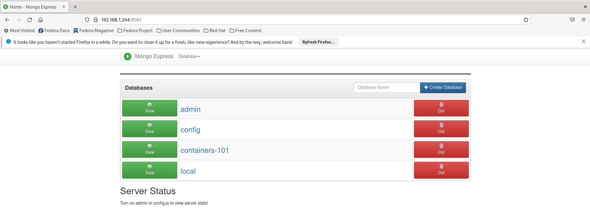
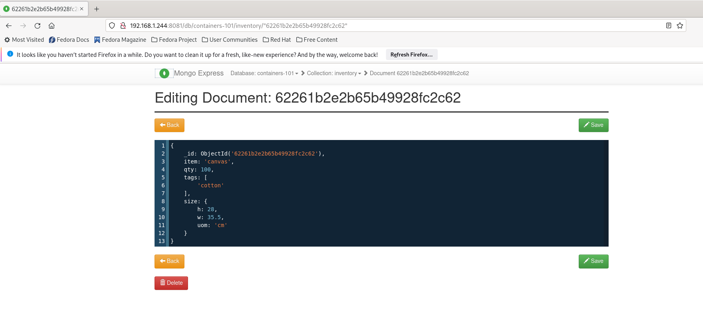

# Getting Familiar With Containers 

Howdie! 

This exercise will walk you through the installation and deployment of containers. You'll learn the basics of container networking, storage, pulls and deployments.

We'll see how we can deploy an application built from two containers, talking to each other via API: 

* MongoDB - Will be represented as a container running on our local server, and providing the data layer for the application 

* MongoDB Express - Will be represented as the UI layer of our application, which interacts with MongoDB in the background 


## Dependency Preparation 

First, let's install all the important things that will allow us running our containers lab properly: 

```bash 
$ yum install -y python3 git
```

Now let's upgrade the `pip3` package manager to get the latest updates python packages: 

```bash
$ pip3 install --upgrade pip
```

Once we've install `Python` anf `Git`, let's install all the python packages needed for the lab: 

```bash
$ pip3 install setuptools_rust flask flask_pymongo 
```

Great! now let's get our hands dirty :) 

## Running Our First Container 

In this section we'll be running a `MongoDB` container, that will be hosted on our local server. 

First, make sure you see the default network being created by using the installed `Docker` package: 

```bash
$ docker network ls

NETWORK ID    NAME        VERSION     PLUGINS
2f259bab93aa  podman      0.4.0       bridge,portmap,firewall,tuning
```

Once you get the proper output, let's run our `MongoDB` container: 

```bash
$ docker run -d --name mongodb -p 27017:27017 -v data:/data/db docker.io/library/mongo:latest

Trying to pull docker.io/library/mongo:latest...
Getting image source signatures
Copying blob 48a403577c28 done  
Copying blob 7bdc1db49ec9 done  
Copying blob e81b1e5a386b done  
Copying blob 7c3b88808835 done  
Copying blob 7b2f602f894c done  
Copying blob 76bbb7dc9013 done  
Copying blob 627a84bea5f4 done  
Copying blob fc06fa2a9f52 done  
Copying blob 0133c89ee92b done  
Copying blob 4e990167b745 done  
Copying config cb2388d1f0 done  
Writing manifest to image destination
Storing signatures
58ecb819e462000e22575e66fa112a5574e2665ed69da5a45408bab9e5a7ba0b
```

As you can see the image was fully pulled from the external registry called `Docker Hub`. This registry contains global container images that can be used publicly on demand. 

*Note Alert!*

Pay attention to the `Docker Run` command we've used: 

* We gave our container a name by running the `--name` flag 

* We've mapped the container port to our local server's port to it'll be available from the outside world 

* We've mapped a volume hosted on our local server to preserve the db files 

* We've used the pulled images locally in order to run the container 

Great! 

Noe let's make sure that our images was successfuly pulled, to do that we'll use the `docker images` command: 

```bash
$ docker images

REPOSITORY                     TAG         IMAGE ID      CREATED       SIZE
docker.io/library/mongo        latest      cb2388d1f0a5  3 days ago    702 MB 
```

As you can see, we see our image presented locally, we see that image tag (can be represented as revision) and we see the image's size. 

Now that we have our image pulled, let's make sure that the container is running: 

```bash
$ docker ps

CONTAINER ID  IMAGE                           COMMAND     CREATED         STATUS             PORTS       NAMES
58ecb819e462  docker.io/library/mongo:latest  mongod      12 seconds ago  Up 12 seconds ago              mongodb
```

To do that we've used the `docker ps` command, which can be described as `docker print services`, this way we retrieve all the running containers on a given host. 

If you remember, we've mapped a volume on our local server, let's see how this volume is being represented on the local filesystem: 

```bash
docker volume inspect data
[
    {
        "Name": "data",
        "Driver": "local",
        "Mountpoint": "/var/lib/containers/storage/volumes/data/_data",
        "CreatedAt": "2022-03-07T09:40:04.161434185-05:00",
        "Labels": {},
        "Scope": "local",
        "Options": {}
    }
]
```

As you can see, this image is actually being mounted to the local filesystem in a given path (you can take a look at the `Mountpoint` value)

I hope you remember that you've mapped a port for the given host as well, let's make sure that it indeed happaned: 

```bash
ss -ntlp | grep 27017 
LISTEN 0      128          0.0.0.0:27017      0.0.0.0:*    users:(("conmon",pid=28626,fd=5))
```

The `ss` command, shows which ports are binded at the operating system level, and indeed we see that our `MongoDB` container has opened the proper port. 

Our containers get IP addressed provided by a DHCP server (dynamic allocation for IP addresses) being shupped automiatically, verify that our container indeed got its address: 

```bash 
$ docker inspect mongodb | grep IPAddress            

"IPAddress": "",
                    "IPAddress": "10.89.0.6",
```

This address is not routed to the outside world by default, what makes our container's address not exposable (it runs on our host internally). 

To login to the container and interact with the `MongoDB` shell, we'll use the `docker exec` command in an interactive state: 

```bash
$ docker exec -it mongodb mongo

MongoDB shell version v5.0.6
connecting to: mongodb://127.0.0.1:27017/?compressors=disabled&gssapiServiceName=mongodb
```

Great! we're inside the shell and we can start playing with our containerized database. 

Let's make sure we can list all the databases in our `MongoDB` instance: 

```bash 
> show dbs
admin   0.000GB
config  0.000GB
local   0.000GB
```

We see that we have all the default databases.
Low let's create a new database using mongo commands: 

```bash
> use containers-101
switched to db containers-101
```

And insert a new document to our database: 

```bash
db.inventory.insertOne(
   { "item" : "canvas",
     "qty" : 100,
     "tags" : ["cotton"],
     "size" : { "h" : 28, "w" : 35.5, "uom" : "cm" }
   }
)
```

The result for inserting the document to the `MongoDB` instance should be: 

```bash
{
        "acknowledged" : true,
        "insertedId" : ObjectId("622627d169da119003018486")
}
```

Let's see the given collections we have under out `containers-101` database: 

```bash
> show collections
inventory 
```

Noe let's run the `show dbs` command again to see that the database was indeed created: 

```bash
> show dbs
admin           0.000GB
config          0.000GB
containers-101  0.000GB
local           0.000GB
``` 

Great! we have a new database in our mongo instance. 

Let's try and query for the created document: 

```bash
> db.inventory.find()

{ "_id" : ObjectId("62261b2e2b65b49928fc2c62"), "item" : "canvas", "qty" : 100, "tags" : [ "cotton" ], "size" : { "h" : 28, "w" : 35.5, "uom" : "cm" } }
```

Now that all is sorted, exit the container and move to the next section: 

```bash
> exit
bye
```

## Attaching the MongoDB UI

First, let's run our `MongoDB Express` container in way that could be contacted with our current running `MongoDB` container: 

```bash
$ docker run -d --net host --add-host mongodb:127.0.0.1 --name mongo-express -e ME_CONFIG_MONGODB_SERVER=mongodb  docker.io/library/mongo-express:latest
```

The only difference is that we've used the `-e` flag, which representes and environment variable being trasfered to our container in runtime. 

We use this environment variable to update `MongoDB Express` on our `MongoDB` connection url. 

Let's make sure both containers are running: 

```bash
$ docker ps

CONTAINER ID  IMAGE                                   COMMAND        CREATED         STATUS             PORTS                   NAMES
27dd53c35083  docker.io/library/mongo:latest          mongod         20 minutes ago  Up 20 minutes ago                          mongodb
3246db2a18b2  docker.io/library/mongo-express:latest  mongo-express  2 minutes ago   Up 2 minutes ago   0.0.0.0:8081->8081/tcp  mongo-express
```

We see that both of them are running, great!

Now let's open a port at the operating system level so that our app can be exposed to the outside world: 

```bash 
$ firewall-cmd --add-port=8081/tcp

success
```

Now access your server's IP address to see that our app is running as expected: 

```bash 
http://YOUR_SERVER_IP:8081
```

Make sure you get the `MongoDB Express` UI: 



We see the database that we've created before using `MongoDB` commands locally, make sure you press the `containers-101` database to browse for its documents: 



Amazing! 
Now try to load a new document to the database, click `Back` and then use the `New Document` button and paste the following: 

```bash
{
    _id: ObjectId('62261b2e2b65b49928fc2c71'),
    item: 'pencils',
    qty: 150,
    tags: [
        'wood'
    ],
    size: {
        h: 5,
        w: 6.1,
        uom: 'cm'
    }
}
```

This document will be then loaded to our `MongoDB` database. 

Now let's make sure to do the opposite and see that this document indeed shows up on our database: 

````bash 
$ docker exec -it mongodb mongo
```

Switch to use our created database: 

```bash
> use containers-101
switched to db containers-101
```

Query the database once again to see the created document: 

```bash
> db.inventory.find()

{ "_id" : ObjectId("62261b2e2b65b49928fc2c62"), "item" : "canvas", "qty" : 100, "tags" : [ "cotton" ], "size" : { "h" : 28, "w" : 35.5, "uom" : "cm" } }
{ "_id" : ObjectId("62261b2e2b65b49928fc2c71"), "item" : "pencils", "qty" : 150, "tags" : [ "wood" ], "size" : { "h" : 5, "w" : 6.1, "uom" : "cm" } }
```

Congratulations! You have finished with your first exercise :) 

