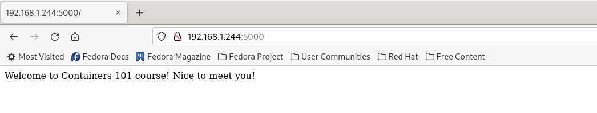
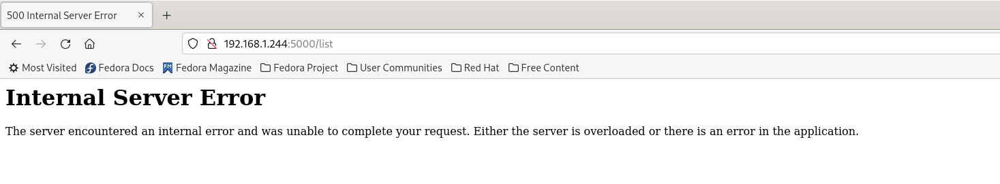
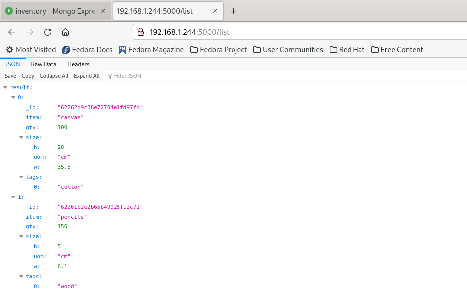

# Building Container Images

We're happy to see that you've finished with your first exercise! 
You can count on us, things will get more complicated now :)

So now that you're a container master, let's complicate things a bit and see how we can build a container iamge from scratch. 

Until now, we've used pre-built container images, now let's use ours!

## Running A Flask Application 

For the following exercise we'll use `Flask` as our development framework. We've created a sample code that runs a `Flask` application, that interacts with `MongoDB`. 

Let's see how our source code turns into a container image!

First, clone the workshop git repo to make sure you have all the needed files: 

```bash 
$ git clone https://github.com/shpaz/containers-101.git
```

Now change the directory context: 

```bash
$ cd containers-101/02-building-container-images
```

Make sure the you have the source code and that you understand it properly: 

```bash
$ cat app.py 

from flask import Flask
from flask import request, jsonify
from flask_pymongo import PyMongo

app = Flask(__name__)
app.config["MONGO_URI"] = "mongodb://mongodb:27017/containers-101"
mongo = PyMongo(app)

@app.route("/")
def home():
    return "Welcome to Containers 101 course! Nice to meet you!"
    
@app.route("/list", methods=["GET"])
def list_collection():
    data = mongo.db.inventory.find()
    output = [] 
    for line in data:
      output.append({'name' : line['name']})
    return jsonify({'result': output})
    
if __name__ == "__main__":
    app.run(host='0.0.0.0')
```

Let's walk through the source code: 
* We are importing all the needed libraries to interact with `Flask` and `MongoDB` 

* We provide the connection string to login to our `MongoDB` instance in the created database 

* The `home()` function return a string under the `/` route 

* The `list_collection()` function interacts with out `MongoDB` instance, and return the documents listed under the database 

Let's open the proper port at the operating system level to make sure the app can be accessed from the outside world: 

```bash
$ firewall-cmd --add-port=5000/tcp

success
```

Run the app locally using `python3` to make sure all is working well: 

```bash
$ python3 app.py 

 * Serving Flask app 'app' (lazy loading)
 * Environment: production
   WARNING: This is a development server. Do not use it in a production deployment.
```

The `Flask` server will be opened in port `5000`. 

Access you server's IP address to see that the app has spawned successfully: 



Nice! our app is `Flask` app is running. But now we've only tested the `home()` function, let's try to list the documents: 

Add a `/list` to your URL to list all the documents under the database.

Was it successful? Why? 



It seems like we've got an `Internal Server Error`, and this is because we don't have any connection to the running `MongoDB` container. 

*Note Alert!* 

Containers are running in a different network namespace in our local server, which means they are not exposed to the outside world, so as not exposed to other containers by default as well. 

Let's add a workaround: 

```bash 
$ echo "127.0.0.1 mongodb" >> /etc/hosts
```

We add the ability to of our app to recognize our `MongoDB` server by its name.

Make sure the content was succesfully added: 

```bash
$ cat /etc/hosts | grep mongo

127.0.0.1 mongodb
```

Now try running the app again and acessing the `/list` route: 



Great! our app is running ... but it's not based on a container, let's make it work. 

## Turning Our Flask Source Code Into An Image

To build our image, we'll use a file called `Dockerfile`. This file contains all the instructions needed for the `Docker` CLI to build our images properly.

Make sure you have yours in your local directory: 

```bash 
$ cat Dockerfile 

FROM python:3
RUN mkdir /usr/src/app
ADD app.py /usr/src/app
ADD requirements.txt /usr/src/app 
WORKDIR /usr/src/app
EXPOSE 5000
RUN pip3 install --upgrade pip
RUN pip3 install -r requirements.txt
ENTRYPOINT ["python","app.py"]
```

Let's try to nderstand what is written in the file: 

* We use the `python:3` base image to be used as a baseline to our `Flask` application 

* We create directories, and copy the source code from the local server, to the container image itself 

* We install all the needed packages for the application to be run successfully 

* We add that runtime command to run our application, as we did in our local server 

Now, let's make sure we have our `requirements.txt` file, which contains all the dependencies and their versions: 

```bash
$ cat requirements.txt 

Flask==1.1.1
Flask-PyMongo==2.3.0
```

We see that we have the `Flask` library, so as the `Flask-PyMongo` library so that we'll be able to interact with our `MongoDB` container. 

Now Let's build our first image!

Run the following command to build your `Flask` app container image: 

```bash 
$ docker build -t flask-app -f Dockerfile 

STEP 1/9: FROM python:3
Resolved "python" as an alias (/etc/containers/registries.conf.d/000-shortnames.conf)
Trying to pull docker.io/library/python:3...
Getting image source signatures
Copying blob 2f2b2e030155 done  
Copying blob ff5b10aec998 done  
Copying blob e4d61adff207 done  
Copying blob 4ff1945c672b done  
Copying blob 12de8c754e45 done  
Copying blob ada1762e7602 done  
Copying blob fa63e4e5310b done  
Copying blob b471a205de6e done  
Copying blob 7c5288a5b779 done  
Copying config 85d2ece591 done  
Writing manifest to image destination
Storing signatures
STEP 2/9: RUN mkdir /usr/src/app
--> 46d97702efc
STEP 3/9: ADD app.py /usr/src/app
--> 622415394d9
.
.
.
STEP 9/9: ENTRYPOINT ["python","app.py"]
COMMIT flask-app
--> 2fb448c057d
Successfully tagged localhost/flask-app:latest
2fb448c057d1e0f2131fd1edd52b9d3679dfc97c0c2c01b56f6f842ec5a503f7
```

The build CLI will go through step by step to make sure all the staged we've indicated are being run. We gave our image a name using the `-t` flag, so as gave the location of our `Dockerfile`. 

Let's make sure our image was created and saved locally: 

```bash
$ docker images | grep flask

localhost/flask-app              latest      2fb448c057d1  35 seconds ago  967 MB
```

Great! now let's run the `Flask` app container using the built image: 

```bash
$ docker run -d --net host --add-host mongodb:127.0.0.1 --name flask-app -p 5000:5000 localhost/flask-app:latest
```

Make sure you have all three containers running: 

```bash
$ docker ps

CONTAINER ID  IMAGE                                   COMMAND        CREATED         STATUS             PORTS                     NAMES
580d54716d80  docker.io/library/mongo:latest          mongod         25 minutes ago  Up 25 minutes ago  0.0.0.0:27017->27017/tcp  mongodb
71ed486d60fe  docker.io/library/mongo-express:latest  mongo-express  25 minutes ago  Up 25 minutes ago                            mongo-express
0d50db8e2391  localhost/flask-app:latest                             1 second ago    Up 2 seconds ago                             flask-app
```

Great! now refresh your browser page to see that all stays the same: 


Congratulations! you have finished with the second exercise :) 