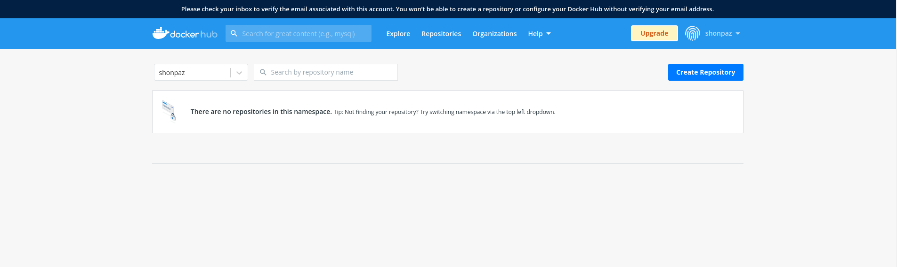
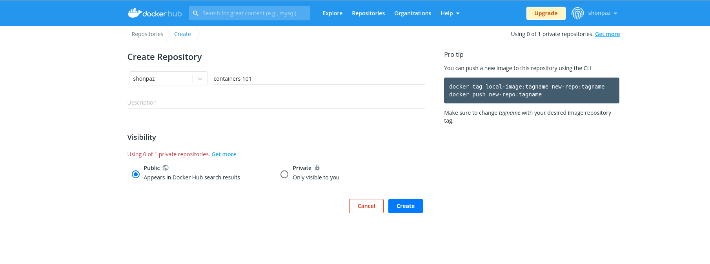
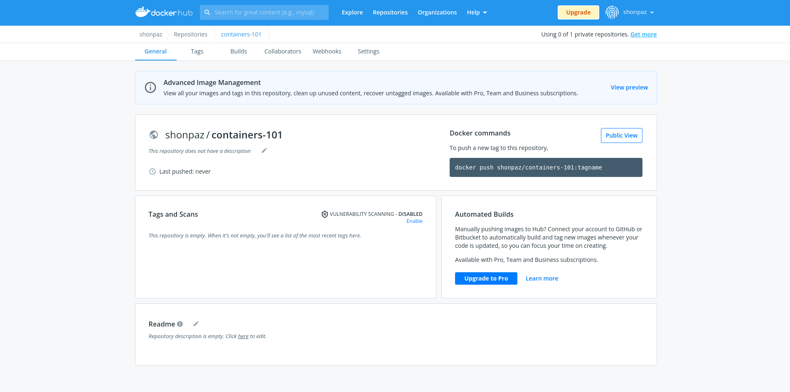
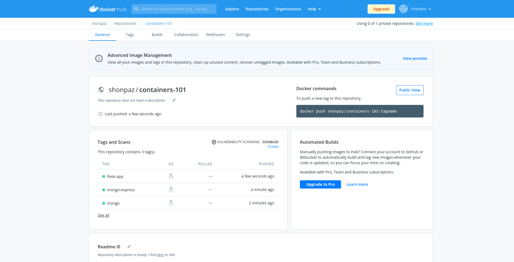

# Pusing Images To Dockerhub 

Now that we have our containers running, we'll be pushing the created images to our personal repositories on `Dockerhub`. 

These images will be useful when we want to go to the next level and use Kubernetes based distributions such as `Red Hat Openshift Container Platform`. 

Using the our personal public images, we'll be able to pull all the relevant dependencies to run our workloads on `Openshift`. 

## Creating A Personal Dockerhub Repo 

Make sure you search for `Docker Hub` online, and get to the next page: 


`Docker Hub` is a global container registry that can be accessed from the internet, we'll be using it to store our created container images from the previous exercises. 

Make sure you sign in to `Docker Hub`, login using your credentials and verify your email. 


Once you have registered successfuly, click the `repositories` button and create your self a repository: 



Click the `Create Repository` button: 



Once you have a repository created, make sure you can see it and verify there's nothing in it: 



## Pusing Our Images 

Let's make sure that we have all our images from the previous exercises: 

```bash 
$ docker images

REPOSITORY                       TAG         IMAGE ID      CREATED       SIZE
localhost/flask-app              latest      ac0d3e76569e  3 hours ago   967 MB
docker.io/library/mongo          latest      cb2388d1f0a5  3 days ago    702 MB
docker.io/library/python         3           85d2ece591c7  5 days ago    939 MB
docker.io/library/mongo-express  latest      2d2fb2cabc8f  4 months ago  148 MB
```

Great, now let's tag the `MongoDB` image so that it can be pushed to `Docker Hub`: 

```bash
$ docker tag docker.io/library/mongo:latest docker.io/shonpaz/containers-101:mongo
```

Make sure you use your own username, mine is `shonpaz` - The username is the one that you signed up with to `Docker Hub`. 

The `tag` command will craete a new image, pointing to the previous one but with another name. Let's make sure this happened: 

```bash
$ docker images | grep containers-101

docker.io/shonpaz/containers-101  mongo       cb2388d1f0a5  3 days ago    702 MB
```

Great, we see that a new image was created with the same size. 

Let's login to `Docker Hub` using the CLI so that we'll be able to push the image: 

```bash
$ docker login docker.io

Username: shonpaz
Password: 
Login Succeeded!
``` 

Make sure you use your own created cerdentials. 

Now let's push the image: 

```bash
$ docker push docker.io/shonpaz/containers-101:mongo

Getting image source signatures
Copying blob 9d9629c471d6 skipped: already exists  
Copying blob 3190bd4cf184 skipped: already exists  
Copying blob f65de56463d2 skipped: already exists  
Copying blob 1a82dad9f03d skipped: already exists  
Copying blob 7f55eb4f92fd skipped: already exists  
Copying blob 68a85fa9d77e skipped: already exists  
Copying blob 20aad67087e4 skipped: already exists  
Copying blob d2241c8f7cda skipped: already exists  
Copying blob be2a3bb7b2ca skipped: already exists  
Copying blob b6a31c97512c skipped: already exists  
Copying config cb2388d1f0 done  
Writing manifest to image destination
Storing signatures
```
Let's do the same with the images left: 

```bash 
$ docker tag docker.io/library/mongo-express docker.io/shonpaz/containers-101:mongo-express

$ docker tag localhost/flask-app docker.io/shonpaz/containers-101:flask-app
```

Now let's push those images to `Docker Hub` as well, as for the `MongoDB Express`: 

```bash
$ docker push docker.io/shonpaz/containers-101:mongo-express

Getting image source signatures
Copying blob 2dad51e6c967 skipped: already exists  
Copying blob 707aac92eb1f skipped: already exists  
Copying blob 39982b2a789a skipped: already exists  
Copying blob 2be6b9c41e8e skipped: already exists  
Copying blob 51babfb9c20f skipped: already exists  
Copying blob d7f356d12400 skipped: already exists  
Copying blob e1b82edaa448 skipped: already exists  
Copying blob 22c519f222b3 skipped: already exists  
Copying config 2d2fb2cabc done  
Writing manifest to image destination
Storing signatures
```

So as for the `Flask` app: 

```bash 
$ docker push docker.io/shonpaz/containers-101:flask-app

Getting image source signatures
Copying blob 316e3949bffa skipped: already exists  
Copying blob 89fda00479fc skipped: already exists  
Copying blob e3f84a8cee1f skipped: already exists  
Copying blob 182f3ce3bf27 skipped: already exists  
Copying blob 48144a6f44ae skipped: already exists  
Copying blob 26d5108b2cba skipped: already exists  
Copying blob a1bdab882f11 done  
Copying blob 2d0a52e9dd70 done  
Copying blob c738a14a1379 done  
Copying blob 8cce279a774e skipped: already exists  
Copying blob e1cbcc210e51 skipped: already exists  
Copying blob 9f4274c32dc6 skipped: already exists  
Copying blob f0420cfd9b96 done  
Copying blob 2530fd704451 done  
Copying config ac0d3e7656 done  
Writing manifest to image destination
Storing signatures
```

Now make sure all container images can be listed in `Docker Hub` by refreshing the `repositories` web page: 




Congratulations! you have finished with the third exercise :) 